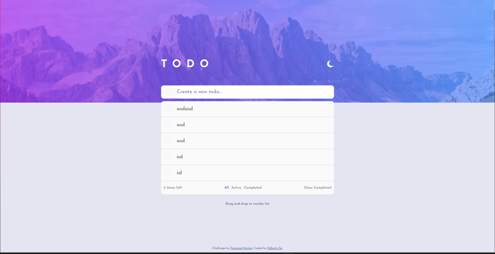

# Frontend Mentor - Todo app solution

This is a solution to the [Todo app challenge on Frontend Mentor](https://www.frontendmentor.io/challenges/todo-app-Su1_KokOW). Frontend Mentor challenges help you improve your coding skills by building realistic projects. 

### The challenge

Users should be able to:

- View the optimal layout for the app depending on their device's screen size
- See hover states for all interactive elements on the page
- Add new todos to the list
- Mark todos as complete
- Delete todos from the list
- Filter by all/active/complete todos
- Clear all completed todos
- Toggle light and dark mode
- **Bonus**: Drag and drop to reorder items on the list

### Screenshot

### Links

- Live Site URL (https://gibasa.github.io/todo/)

### Built with

- Semantic HTML5 markup
- CSS custom properties
- Flexbox
- CSS Grid
- Mobile-first workflow
- [Vue.js](https://vuejs.org) - JS library

### What I learned

I practiced more the use of Vue.js. I learned how to create elements with drag and drop functionality, and I learned how to add dark/light functionality to the website. This was my first project in Vue.js using Vite with deployment on GitHub Pages. Additionally, I continued to practice my HTML and CSS skills. It was very fulfilling to complete this challenge.

## Author

- Frontend Mentor - [@Gibasa](https://www.frontendmentor.io/profile/Gibasa)

